# Wayfinder 1.6.0 — revue d'architecture avant release

Date de la revue : 22 juin 2026  
Code examiné : branche `codex/release-v1.6.0`, version applicative `1.6.0`,
schéma SQLite `14`.

## 1. Résumé exécutif

Wayfinder 1.6.0 est scientifiquement et fonctionnellement beaucoup plus solide
que la branche historique : le cœur est pykep3-only, SQLite est devenu le seul
datastore actif, le calcul exact d'éjection est partagé entre fitness et
décodage, les erreurs des workers Pygmo remontent correctement et la télémétrie
de convergence/migration est exploitable. La suite automatisée passe : **52/52
tests**, et tous les modules Python compilent.

L'architecture reste toutefois celle d'un outil scientifique ayant grandi par
itérations. La classe `Wayfinder` concentre 3 750 lignes et cumule les rôles de
façade, générateur de jobs, orchestrateur Pygmo, service de trajectoire, service
de requêtes et contrôleur de plots. Cette concentration est encore praticable
en scripts, mais elle constitue le principal obstacle à une GUI robuste.

La recommandation n'est pas de construire une hiérarchie d'héritage profonde.
Le modèle actuel en a très peu, et c'est plutôt sain. Il faut conserver une
façade simple tout en la décomposant par **composition** en services typés :
jobs, optimisation, trajectoires, analyses et repository SQLite.

Les corrections priorité 0 ont été largement intégrées le 22 juin : acquisition
atomique avec lease et reprise, télémétrie de stage complète en schéma v14, maintien
explicite du `funnel` trois niveaux comme défaut 1.6, environnement Conda
reproductible, handoff actualisé et périmètre de release audité. Les deux
fixtures SQLite suivies sont désormais volontairement migrées en v14 et les
assets documentaires correspondent aux benchmarks retenus pour la revue. La
revue finale a également fermé le claim P0 par heartbeat et fencing atomique.

## 2. Workflow actuel

### 2.1 Workflow utilisateur

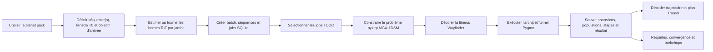

Le chemin recommandé pour une nouvelle recherche est :

1. instancier `Wayfinder(planet_pack="Vanilla")` ou `"JNSQ"` ;
2. créer des jobs avec `add_direct_t0_batch_sqlite()` ;
3. optimiser avec `optimize_sqlite()` ;
4. interroger avec `best_known_sqlite()` / `find_best_known_plan_sqlite()` ;
5. raffiner ou visualiser via les méthodes SQLite de porkchop.

`add_batch_sqlite()` conserve le mode alpha historique. Le mode direct est
préférable pour les recherches récentes : `T0` est l'axe de binning et
`leg_tof_bounds_json` contient les bornes autoritaires de chaque jambe. Les
sommes `tof_min`/`tof_max` servent au filtrage et à la compatibilité.

### 2.2 Cycle de vie des données

Un batch contient un template combinatoire. Celui-ci produit des séquences
concrètes, puis un ou plusieurs jobs par fenêtre de départ. L'identité d'un job
est son hash canonique ; le même job peut appartenir à plusieurs batches.

Chaque tentative d'optimisation crée un `run`. Un run reçoit des snapshots de
convergence, des résumés de stages et des populations. Un run réussi possède
exactement un résultat et un gène gagnant. Les échantillons de porkchop
référencent le run qui les a engendrés.

Limite actuelle : `start_run()` crée un run `RUNNING`, mais ne passe pas le job
de `TODO` à `RUNNING`. Deux consommateurs concurrents peuvent donc sélectionner
le même job. Le modèle de données sait représenter plusieurs runs, mais le
workflow ne protège pas contre une exécution involontaire en double.

### 2.3 Workflow d'optimisation

L'API publique a encore `optimizer_strategy="funnel"` comme défaut. Ce funnel
historique comporte trois niveaux : exploration approximative, réduction
intermédiaire et éjection exacte.

La chaîne expérimentale récente `funnel_scout_archive` ajoute un L0 large,
préserve un L2 utile et nourrit L3 depuis une archive exacte :

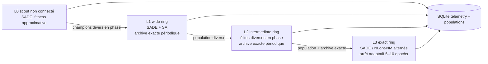

Le L0 existe en variantes 32/64/128 îles, toujours avec une population de huit
et un budget égal de 128 000 évaluations. Les générations par epoch valent
respectivement 100/50/25. Le screen actuel élimine 128 ; 32 est plus consistant
sur KEKKJ, tandis que 64 reste le défaut prudent tant que 32 n'a pas été répété
sur une seconde série complète.

## 3. Architecture logicielle actuelle

### 3.1 Modules

| Module | Taille | Responsabilité réelle |
|---|---:|---|
| `_Wayfinder.py` | 3 750 lignes | Façade, génération, orchestration Pygmo, transitions de funnel, requêtes, raffinements et plots |
| `_SQLiteStore.py` | 1 519 lignes | Schéma v13, persistance et projections de lecture |
| `_Trajectory.py` | 608 lignes | Calcul d'éjection, décodage, métriques et sortie TransX |
| `_Optimization.py` | 171 lignes | Encodage ToF et décoration de fitness |
| `planet_packs/*` | 601 lignes | Constantes et objets pykep Vanilla/JNSQ |

Les dépendances principales sont `pykep`, `pygmo`, NumPy, pandas, Matplotlib et
seaborn. Pandas est correctement cantonné aux vues d'analyse et n'est plus le
datastore de l'optimiseur.

### 3.2 Schéma de classes et héritage

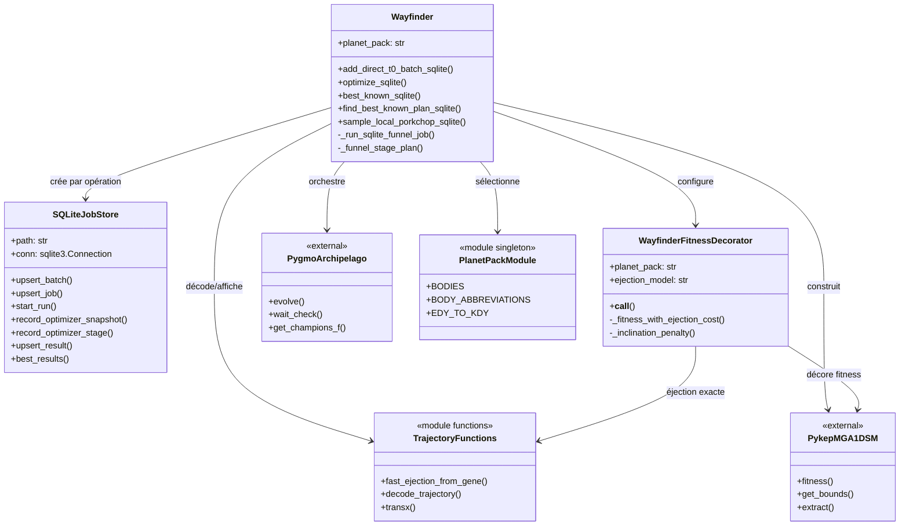

Il n'existe pas d'héritage applicatif significatif. `Wayfinder`,
`SQLiteJobStore` et `WayfinderFitnessDecorator` héritent directement de
`object`. Les objets planétaires et problèmes viennent de pykep/pygmo. Les
fonctions de `_Trajectory.py` acceptent parfois un argument nommé `self` qui
est en réalité un UDP pykep ; ce style pseudo-méthode est hérité du code ancien
et brouille le contrat sans constituer une vraie hiérarchie.

### 3.3 Cohérence des frontières

Points solides :

- le calcul exact `fast_ejection_from_gene()` est partagé par le décorateur et
  le décodeur ; fitness exacte et résultat décodé sont cohérents ;
- le store ne dépend pas de `Wayfinder`, ce qui facilite son extraction ;
- les planet packs sont regroupés derrière `PACKS` ;
- `wait_check()` fait remonter les exceptions multiprocessing ;
- la topologie et les politiques de migration sont attachées aux vraies îles ;
- les algorithmes de production restent natifs Pygmo.

Points faibles :

- `Wayfinder` mélange logique métier, orchestration, SQL indirect et UI
  Matplotlib ;
- beaucoup de contrats transitent par des dictionnaires non typés et des
  colonnes JSON ; une faute de clé apparaît seulement à l'exécution ;
- le décorateur retrouve la séquence en parsant `get_extra_info()` avec une
  expression régulière : contrat fragile face à un changement pykep ;
- les presets d'optimisation sont des listes positionnelles stockées dans le
  constructeur (`[gen, islands, pop, epochs]`) ;
- les noms publics mélangent snake_case et héritage historique (`Kdate`,
  `debugPrint`, `generateSequences`) ;
- les imports supposent que `WayfinderCore` est injecté dans `sys.path` ; le
  projet ne possède ni package installable ni `pyproject.toml` ;
- `DEVELOPMENT.md` et certaines sections de `SEARCH_ARCHITECTURE.md` décrivent
  un état antérieur aux derniers funnels et au schéma v13.

## 4. Schéma SQLite v13

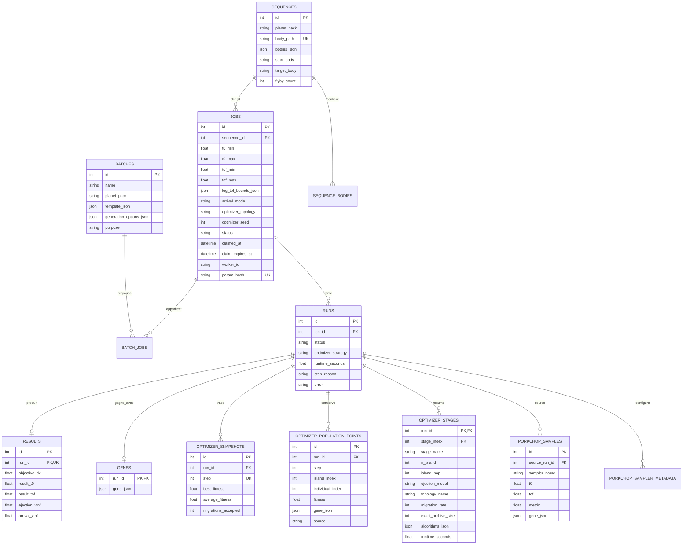

La normalisation générale est bonne : les tentatives sont séparées des jobs,
les résultats ne sont pas écrasés entre runs, et la relation batch/job est
many-to-many. L'archive exacte n'a pas besoin d'une table `optimizer_elites`
séparée à ce stade : elle est persistée comme population avec
`source="exact_archive_stage3_seed"`, ce qui maintient le lien au run et au
step sans dupliquer le modèle.

Risques DB restant avant GUI :

- le claim atomique avec lease est maintenant présent, mais une future GUI
  devra renouveler les leases des runs très longs ;
- une connexion SQLite attachée à chaque store, sans API context manager ;
- pas de `busy_timeout` ni de WAL applicatif pour un lecteur GUI concurrent ;
- commits très fréquents, notamment à chaque snapshot, susceptibles
  d'augmenter les locks et l'I/O avec un rafraîchissement live ;
- migrations ad hoc par `_ensure_column()` plutôt que scripts versionnés et
  transactionnels ;
- les jobs expirés sont récupérés et leurs runs abandonnés sont clôturés en
  `FAILED` avec `stop_reason="claim_expired"` ; une future GUI devra toutefois
  renouveler activement les leases des calculs dépassant leur durée nominale.

La fixture `Tests/wayfinder_reference.sqlite` passe `PRAGMA integrity_check`,
ne présente aucune violation de clé étrangère et annonce le schéma 14.

## 5. Tests et historique des choix

### 5.1 État de la suite

La suite automatisée contient 52 tests :

- 14 tests datastore : génération, déduplication, claim atomique, reprise,
  fencing d'un worker périmé, migration v13→v14, snapshots, benchmark
  filtering, requêtes, plots et porkchop ;
- 38 tests de régression : pykep3, décodage Vanilla/JNSQ, encodages alpha et
  direct, ToF, topologies, migration, funnels, archive, arrêt adaptatif et
  calcul d'éjection.

Commande vérifiée :

```powershell
python -m pytest -q
# 48 passed
```

Les scripts `Tests/run_*.py` fournissent des smoke tests et benchmarks utiles,
mais ne sont pas tous exécutés par pytest. Il manque donc encore un test CI
court qui lance réellement un archipel multiprocessing Windows, écrit une DB,
relit le résultat et vérifie la reprise après erreur.

### 5.2 De l'encodage alpha à la recherche directe

La première question était de reproduire les performances d'un planner MGA
direct. Les tests ont montré que le mode direct avec bornes par jambe converge
vite, mais qu'une enveloppe planner trop serrée excluait la bonne fenêtre KEKKJ.
Le choix actuel est donc : direct pour les nouveaux jobs, `T0` comme axe de
binning, bornes ToF explicites et profil `relaxed` pour éviter le faux gain de
vitesse obtenu en supprimant le bon bassin.

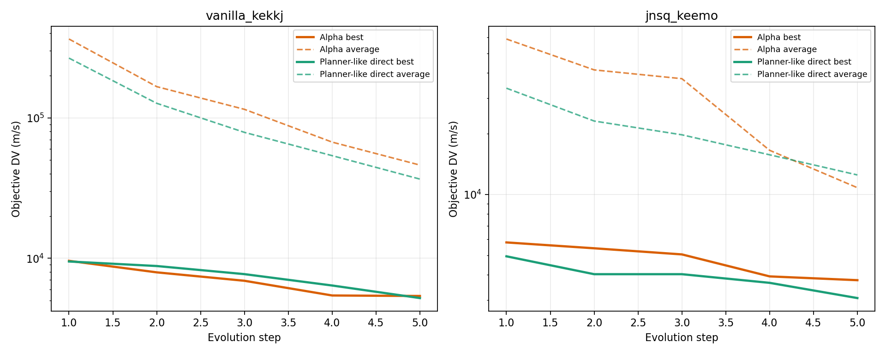

### 5.3 Topologie et migration

L'audit a trouvé deux bugs structurants : topologies créées avec deux fois le
nombre de sommets et politiques de migration posées sur l'archipel vide au lieu
des îles. Après correction, `wait_check()`, la télémétrie et les tests de
migration ont rendu les benchmarks interprétables.

La recherche contrôlée montre qu'une absence de migration conserve de la
diversité mais piège les populations dans de mauvais bassins. KEKKJ préfère un
taux modeste 1–2 ; KEEMo profite parfois de 4. Le défaut neutre actuel est 2,
sur ring.

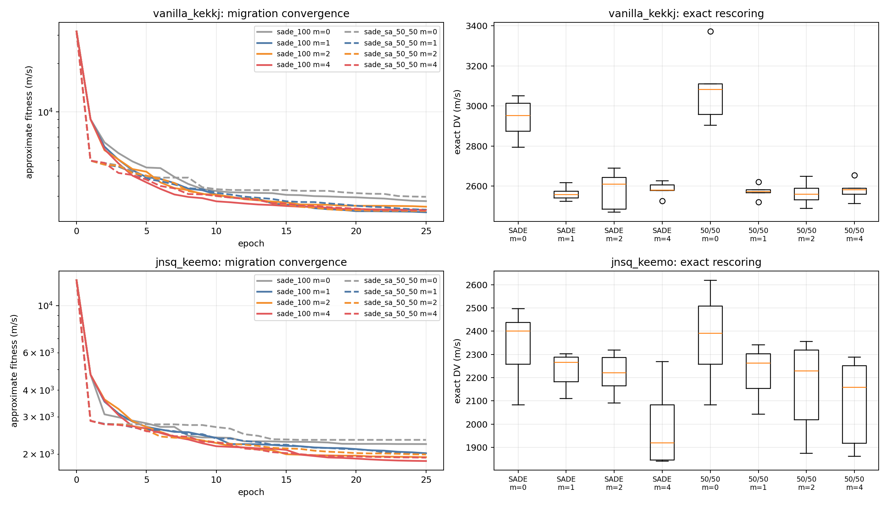

### 5.4 Choix du portfolio L3

SciPy Nelder–Mead n'était pas sérialisable proprement dans l'archipel Windows.
Il a été remplacé par `pg.nlopt("neldermead")`, donc toujours via Pygmo. Sur
huit îles et budgets équivalents, SADE pur était trop lent à raffiner ; NM pur
et l'alternance convergeaient nettement plus vite. L3 alterne donc SADE et
NLopt-NM, ce qui garde une composante globale et une composante locale.

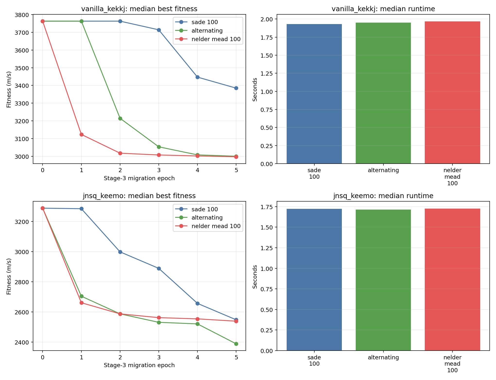

### 5.5 Diversité de phase, modèle d'éjection et chaîne à trois niveaux

Le passage L1→L2 depuis les seuls champions perdait des bassins utiles. La
sélection actuelle classe un pool de bons candidats puis maximise leur distance
dans un embedding de phase (positions/vitesses aux rencontres et ToF
normalisés). L2 reste nécessaire : les expériences 25/25 ont confirmé qu'il ne
peut pas être simplement raccourci à 25 epochs sans dégrader la robustesse.

Le saut L2→L3 a ensuite révélé une incohérence de référentiel entre fitness et
décodage. Les deux utilisent maintenant le même calcul fermé et choisissent le
minimum entre éjection directe inclinée et éjection plane suivie d'une
correction normale à la SOI. L'écart final fitness/décodage est nul dans les
qualifications corrigées.

La qualification de référence 20/40/5 sur dix seeds a donné :

- KEKKJ : médiane 2 452,5 m/s, worst 2 881,8 m/s ;
- KEEMo : médiane 2 044,4 m/s, worst 2 305,3 m/s.

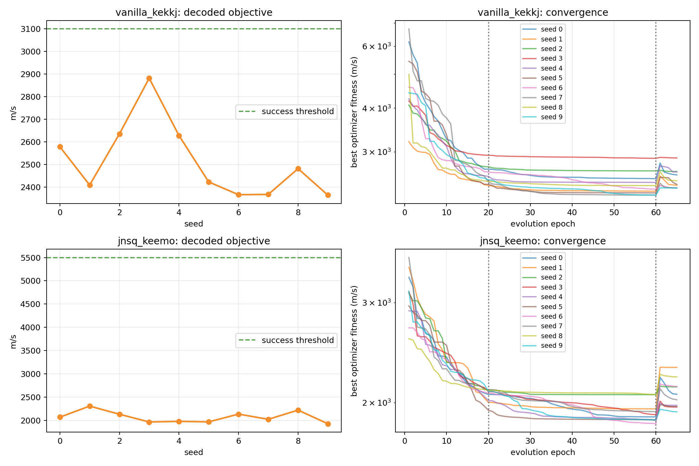

### 5.6 L0 large, archive exacte et L3 adaptatif

La dispersion restante venait de mauvais bassins atteints avant L2. La chaîne
récente ajoute un L0 non connecté à budget constant et une archive
multi-fidélité : L1/L2 travaillent avec la fitness rapide, mais leurs champions
et quelques élites diverses sont rescored exactement tous les cinq epochs. L3
repart de l'archive et de la population finale L2.

Sur dix seeds, la première qualification 64 îles a amélioré KEKKJ à 2 403,8
m/s de médiane et KEEMo à 1 958,5 m/s. L'archive a effectivement récupéré un
candidat exact perdu par la population L2 finale dans 3/10 runs KEKKJ et 1/10
KEEMo. Le coût médian a augmenté d'environ 53 %.

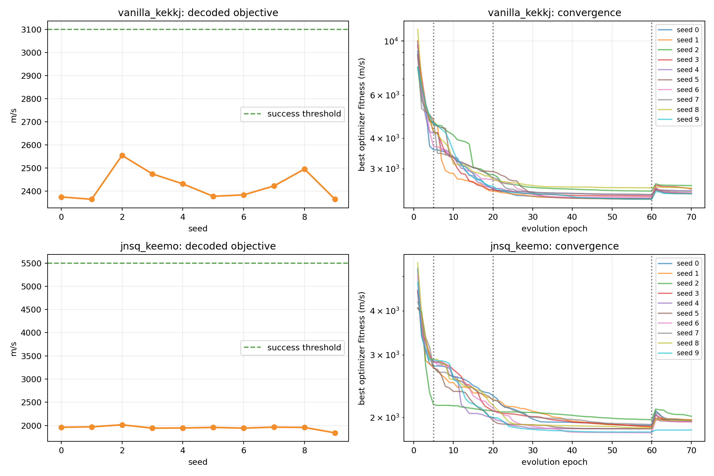

Le screen égal-budget 32/64/128 montre que 128 îles sont trop peu profondes.
32 est la distribution la plus compacte sur KEKKJ ; 64 a produit deux séries
très différentes à seeds identiques, rappelant que les migrations asynchrones
ne sont pas déterministes. Le stop L3 n'explique pas la majorité des outliers :
presque tous ont utilisé le plafond de dix epochs.

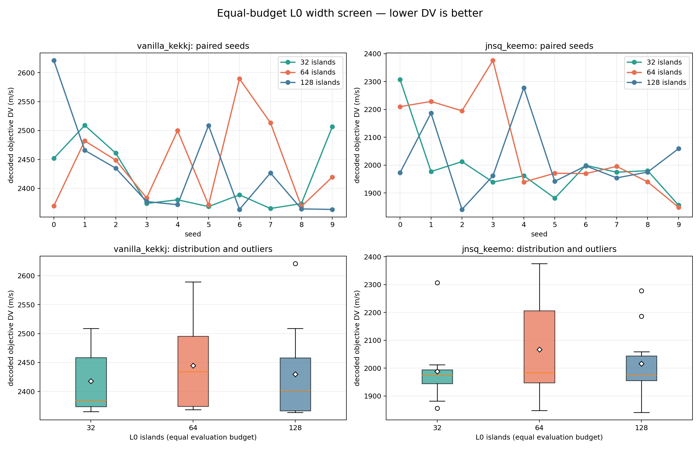

## 6. Analyse critique de la hiérarchie et de la cohérence

### 6.1 Ce qu'il ne faut pas faire

La préparation GUI ne justifie pas de créer une classe de base abstraite
`WayfinderBase` avec des sous-classes Vanilla/JNSQ et GUI/CLI. Les différences
de planet packs sont des données et stratégies, pas des identités objet. Une
hiérarchie profonde augmenterait le couplage et rendrait les workers Windows
plus difficiles à sérialiser.

### 6.2 Ce qu'il faut préserver

- une façade utilisateur courte ;
- des algorithmes Pygmo natifs et sérialisables ;
- une base unique consultable entre batches ;
- des fonctions scientifiques pures quand cela est possible ;
- la séparation job/run/result ;
- les populations et snapshots nécessaires à l'analyse a posteriori.

### 6.3 Problème central : la classe God Object

`Wayfinder` possède plus de cinquante méthodes publiques/privées couvrant cinq
domaines. Une GUI appellera ces méthodes depuis des callbacks, devra afficher
la progression et gérer les erreurs. Si la classe reste monolithique, la GUI
deviendra le second orchestrateur du système et dupliquera les règles métier.

Le découpage doit se faire derrière une façade compatible, sans réécriture
scientifique simultanée. Les premières extractions sont naturelles :

- `JobService` : validation et génération des specs ;
- `OptimizationService` : plan de funnel et exécution ;
- `TrajectoryService` : décodage et métriques ;
- `AnalysisService` : convergence, résultats et porkchop ;
- `SQLiteRepository` : transactions et projections ;
- `WayfinderFacade` : cas d'usage stables pour CLI/GUI.

### 6.4 Cible proposée

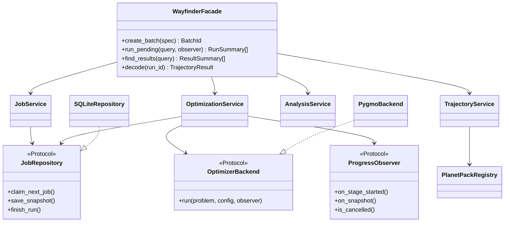

Les `Protocol` servent de contrats structurels et de points de test ; ils ne
forcent pas une hiérarchie métier. Les données devraient devenir des
`dataclass(frozen=True)` : `JobSpec`, `SearchWindow`, `OptimizerConfig`,
`StageConfig`, `RunSummary`, `TrajectoryResult` et `ProgressSnapshot`.

## 7. Suggestions critiques d'amélioration

### Priorité 0 — statut avant release

1. **Claim atomique des jobs : résolu et fencé.** `optimize_sqlite()` réclame
   un seul job juste avant son exécution, renouvelle le lease entre les epochs
   Pygmo et publie atomiquement run, résultat, gene et statut final uniquement
   si `worker_id + claimed_at` possèdent encore le claim. Le test de reprise
   vérifie explicitement qu'un ancien worker ne peut plus écrire.
2. **Télémétrie de stage : résolu.** `topology_name`, `migration_rate` et
   `exact_archive_size` sont persistés en schéma v14.
3. **Défaut optimizer : décidé.** `funnel` reste le défaut stable de 1.6 ;
   scout/archive reste une option de recherche explicite.
4. **Environnement reproductible : résolu.** `environment.yml` et le point
   Windows `Library/bin` sont documentés.
5. **Handoff : résolu.** `DEVELOPMENT.md` et `SEARCH_ARCHITECTURE.md` reflètent
   le schéma, les tests et les stratégies actuels.
6. **Périmètre de release : audité.** Les modifications du cœur, des tests et
   des documents appartiennent à 1.6. Les deux fixtures SQLite suivies ont été
   volontairement migrées en v14 ; elles passent `integrity_check` et
   `foreign_key_check`. Les six PNG sous `DOC/assets` sont les graphes cités
   par cette revue. Les caches Python/pytest et journaux SQLite restent exclus.

### Priorité 1 — fondations GUI

1. Créer un vrai package installable et supprimer les injections de `sys.path`.
2. Extraire le repository SQLite avec context manager, transactions, WAL,
   `busy_timeout` et une connexion par thread/processus.
3. Exécuter l'optimiseur dans un processus de service, pas dans le thread UI.
   Les callbacks GUI ne doivent jamais manipuler directement l'archipel Pygmo.
4. Fournir observation de progression, annulation coopérative entre epochs et
   reprise après crash.
5. Séparer données de plot et rendu : les services retournent des séries/DTO,
   la couche GUI choisit Matplotlib, web ou Qt.
6. Introduire une taxonomie d'erreurs : validation, DB, problème orbital,
   worker Pygmo et annulation utilisateur.
7. Garder une façade de compatibilité qui délègue aux nouveaux services afin de
   ne pas casser les scripts 1.6.

### Priorité 2 — robustesse et dette technique

1. Remplacer les listes de presets par `OptimizerConfig`/`StageConfig` typés et
   sérialisables dans la DB.
2. Remplacer le parsing de `get_extra_info()` par un contexte de séquence
   explicite dans le décorateur.
3. Transformer les fonctions pseudo-méthodes de `_Trajectory.py` en fonctions
   pures avec paramètres nommés ou en petit service sans état.
4. Centraliser le registre des planet packs et convertir leurs grandes tables
   de module en objets de données validés.
5. Ajouter un test multiprocessing concurrent réel marqué `integration` ; les
   tests de migration v13→v14 et de reprise `RUNNING` sont maintenant présents.
6. Mesurer et regrouper les écritures de snapshots en transactions pour limiter
   le coût I/O.

### Priorité 3 — améliorations scientifiques

1. Construire le surrogate 2D d'éjection indexé par composantes plane et
   normale de `v_inf`, validé contre le calcul exact.
2. Ajouter un garde de qualité au stop adaptatif L3 pour éviter de déclarer un
   plateau dans un mauvais bassin.
3. Répéter le screen L0 32 îles ; traiter 128 comme rejeté et 64 comme contrôle.
4. Maintenir un harness synchrone de recherche pour les comparaisons
   reproductibles, distinct du moteur asynchrone de production.
5. Étudier des presets dépendants de la séquence pour migration et SADE, sans
   introduire d'algorithmes hors Pygmo.

## 8. Verdict de release

**Go technique pour préparer la release 1.6.** Le fencing du claim, la
migration automatisée v13→v14, les 52 tests et le smoke réel du funnel Pygmo
sont validés. Le tag reste conditionné à la revue finale du diff puis au commit
intentionnel du périmètre déjà audité.

La préparation GUI doit ensuite commencer par les frontières de
service et le lifecycle des jobs, non par les widgets. Le meilleur premier
incrément reste un `SQLiteRepository.claim_next_job()` transactionnel et un
`OptimizationService.run_job()` observable, appelés derrière la façade
existante.
