# Funnel, pressure gate, and prior-seeded continuation report

Date: 2026-07-10
Scope: Wayfinder 1.6.x optimizer experiments around the L0 recall funnel, boundary-pressure rescue, and KEEMo → KEEMoMo continuation.

## Executive summary

The public API default remains the stable three-stage `funnel`. Within the
L0-oriented family, `funnel_l0_recall_64_mbh_between` is the reference chain
and the explicit `_pressure_cascade` variant is the qualified robustness
candidate. The additive 16+4 Hill-Valley portfolio remains experimental.

For KEEMo, the L0 pressure gate plus cascade rescue is a strong improvement:

- baseline consistency: 5/10 seeds below 5500 m/s;
- cascade consistency: 10/10 seeds below 5500 m/s;
- median runtime increases from about 5.4 s to about 11.2 s for KEEMo, still acceptable for a robustness rescue.

For KEEMoMo, pressure rescue alone is not enough. The optimizer finds a low basin, but not consistently. However, seeding KEEMoMo from prior KEEMo solutions is extremely effective:

- baseline KEEMoMo: 2/10 seeds below 5500 m/s, median 7174.9 m/s;
- KEEMo prior-seeded KEEMoMo: 10/10 seeds below 5500 m/s, median 4477.5 m/s.

This suggests two separate mechanisms:

1. L0 pressure cascade is a good general robustness tool.
2. Prior-seeded continuation is a promising future add-on for extending or powering down trajectories, but should remain experimental until its seed source is persisted and reproducible.

## Funnel development path

The initial problem was that good solutions were known to exist, but the optimizer often landed in a wrong basin. The development path was:

1. Use direct per-leg TOF bounds rather than alpha-only timing.
2. Add a wide unconnected L0 scout to increase basin recall.
3. Preserve phase-diverse elites between stages.
4. Insert a small MBH bridge between L0/L1 and L2.
5. Add exact-ejection archive support so L3 can recover exact-fitness candidates.
6. Detect L0 boundary pressure and selectively rerun adjusted search boxes.
7. Add cascade rescue: same-seed first, retry-seed only if still suspect.

The key insight is that L3 is a local polisher. It cannot reliably fix a trajectory already committed to the wrong basin. The useful corrections happen earlier: L0/L1 basin selection and L2 population handoff.

## Pressure-gate logic

Pressure is detected from L0 elite TOFs when the top population presses against a leg bound. The current gate uses:

- source: `stage_1_final`;
- top population: 32 candidates;
- near-bound pressure: 3%;
- adjustment: widen pressured flank by 20%, capped by min/max day deltas;
- trigger proxy: pressure plus poor L1 improvement or high L1/median-L0 ratio.

The cascade rescue policy is:

1. Run same-seed adjusted-bounds branch.
2. If the result is still suspect, run retry-seed adjusted-bounds branch.
3. Keep the best result among baseline and rescue branches.

In the current benchmark harness, “suspect” can be defined by an explicit quality threshold or, if no threshold is provided, by weak relative improvement.

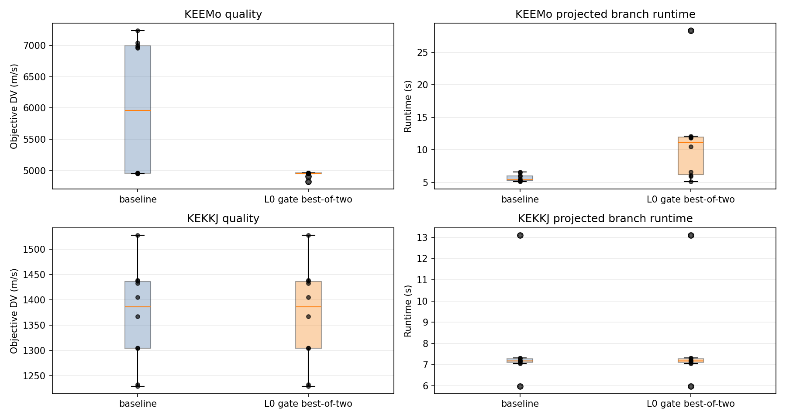

## KEEMo and KEKKJ 10-seed results

Strategy: `funnel_l0_recall_64_mbh_between`
Seeds: 0–9
Cases: Vanilla KEKKJ, JNSQ KEEMo

| Case | Mode | Median DV | Max DV | Success criterion | Runtime median |
|---|---:|---:|---:|---:|---:|
| KEEMo | baseline | 5957.9 | 7236.0 | 5/10 below 5500 | 5.4 s |
| KEEMo | same-seed rescue | 4956.5 | 6997.7 | 9/10 below 5500 | 10.6 s |
| KEEMo | retry-seed rescue | 4958.0 | 5089.5 | 10/10 below 5500 | 16.7 s |
| KEEMo | cascade rescue | 4956.5 | 4960.1 | 10/10 below 5500 | 11.2 s |
| KEKKJ | baseline/cascade | 1386.2 | 1527.8 | 9/10 below 1500 | 7.2 s |

Cascade is the best compromise here: it only paid retry for the seed where same-seed remained bad.

## L1/L2/L3 convergence

The L1/L2/L3 plots show that KEEMo cascade improves the trajectory before L3. The exact-ejection stage then benefits from a better basin.

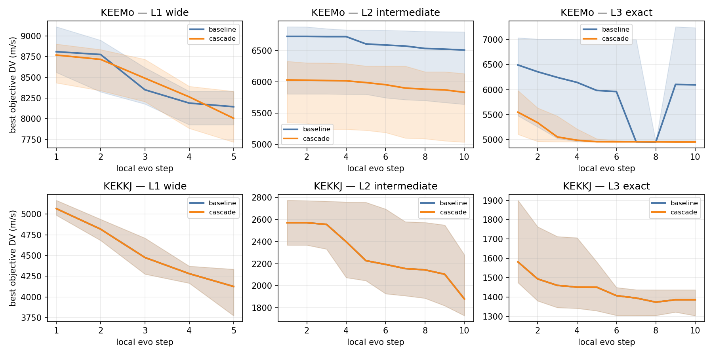

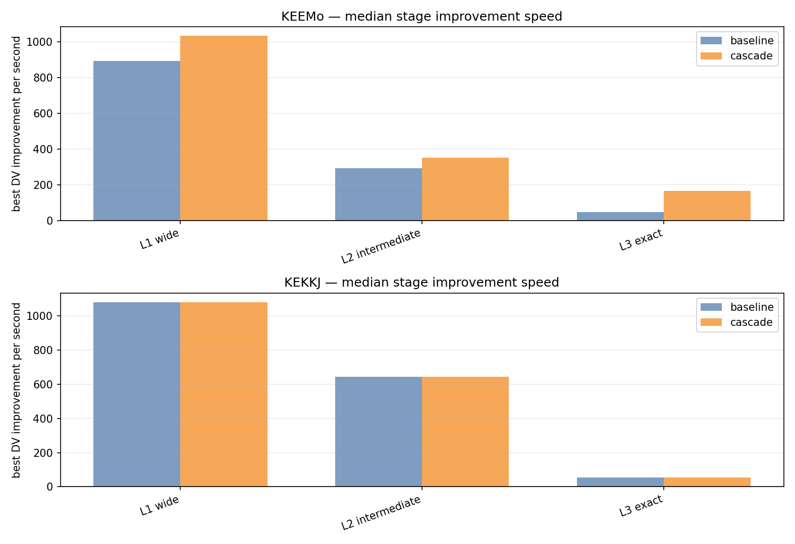

Median stage improvement speed on KEEMo:

| Stage | Baseline | Cascade |
|---|---:|---:|
| L1 wide | 893 m/s/s | 1032 m/s/s |
| L2 intermediate | 293 m/s/s | 350 m/s/s |
| L3 exact | 48 m/s/s | 165 m/s/s |

The KEKKJ curves are unchanged because cascade did not need to branch there.

## KEEMoMo stress test

KEEMoMo was tested as `Kerbin-Eve-Eve-Moho-Moho` on JNSQ, using the same broad setup as KEEMo.

Baseline full funnel:

- median DV: 7174.9 m/s;
- best DV: 4679.3 m/s;
- 2/10 seeds below 5500 m/s;
- many high-basin solutions have terminal arrival v_inf around 3.6–4.8 km/s.

Pressure-all cascade:

- best DV: 4515.1 m/s;
- about 3/10 seeds reach the low basin;
- most high-basin seeds remain high.

This shows pressure rescue alone is not enough. KEEMoMo has strongly separated basins.

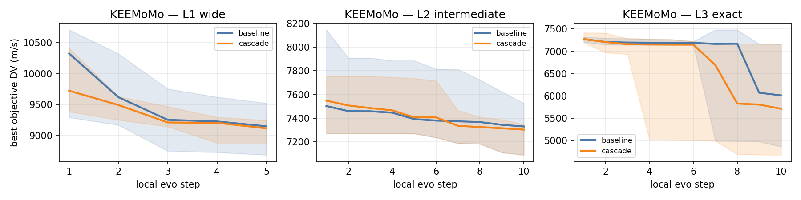

## KEEMo → KEEMoMo prior-seeded continuation

The continuation test used good KEEMo genes as priors for KEEMoMo. Since direct encoding is per-leg, the KEEMo gene can be extended by appending a plausible Moho flyby and Moho→Moho TOF.

This is not yet a production feature. The current implementation uses `initial_seed_genes`, an internal experimental hook passed to `optimize_sqlite()`.

Results:

| Mode | Median DV | Best DV | Max DV | Below 5500 | Runtime median |
|---|---:|---:|---:|---:|---:|
| KEEMoMo baseline | 7174.9 | 4679.3 | 7712.4 | 2/10 | 12.3 s |
| KEEMo prior-seeded | 4477.5 | 4474.3 | 4548.7 | 10/10 | 11.3 s |

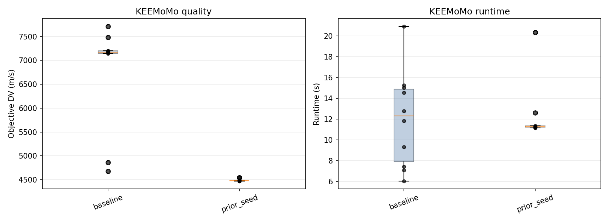

Interpretation: this is a powerful continuation mechanism. It may later become an add-on for extending sequences, adding resonant loops, or powering down difficult arrivals. It should not become core optimizer behavior yet.

## Code cleanup and standardized analysis

New shared helper:

- `Tests/benchmark_analysis.py`

It centralizes:

- sequence/case labels;
- SQLite result extraction;
- grouped DV/runtime summaries;
- standard quality/runtime box plots.

Recent scripts migrated or cleaned:

- `Tests/plot_l123_convergence.py`
- `Tests/run_keemomo_prior_seed_benchmark.py`
- `Tests/run_l0_pressure_gate_benchmark.py` now has explicit `same_seed`, `retry_seed`, `both`, and `cascade` rescue modes.

Temporary `_tmp_*` benchmark SQLite files should be removed before commit. Larger benchmark DBs and plots were kept because they are the evidence for this report.

## Integration status

The pressure cascade has been integrated into the core funnel as an explicit strategy suffix:

- base strategy: `funnel_l0_recall_64_mbh_between`;
- production candidate: `funnel_l0_recall_64_mbh_between_pressure_cascade`.

The suffix preserves the base funnel stage plan and adds a serialized `pressure_cascade` block to `funnel_config_json`. This avoids silently changing old runs while making the pressure gate available through normal `optimize_sqlite()` execution.

Runtime behavior:

1. run the normal funnel;
2. inspect L0 top candidates for leg-TOF boundary pressure;
3. if L0 is pressured and L1 improvement looks weak, run an adjusted-bounds same-seed branch;
4. if same-seed rescue still looks suspicious, run a retry-seed branch;
5. persist the best branch as the run result.

Branch telemetry is stored in the same run using separated stage indices:

- baseline stages: `1..N`;
- same-seed pressure rescue: `101..`;
- retry-seed pressure rescue: `201..`.

This keeps optimizer stage telemetry visible without overwriting the baseline stages.

## Integrated 10-seed rerun

Rerun date: 2026-07-16
Strategy: `funnel_l0_recall_64_mbh_between_pressure_cascade`
Cases: Vanilla KEKKJ, JNSQ KEEMo
Seeds: 0-9

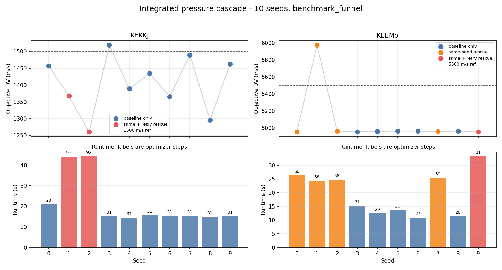

| Case | Success proxy | Median DV | Best DV | Worst DV | Median runtime | Branches |
|---|---:|---:|---:|---:|---:|---:|
| KEEMo | 9/10 below 5500 | 4958.0 | 4950.2 | 5975.9 | 19.8 s | 5 same-seed, 1 retry |
| KEKKJ | 9/10 below 1500 | 1411.9 | 1260.3 | 1519.6 | 15.2 s | 2 same-seed, 2 retry |

Interpretation:

- the integrated strategy runs and persists correctly through normal `optimize_sqlite()`;
- the pressure cascade is active and records rescue branches using separated stage indices;
- KEEMo remains much more stable than the old non-gated baseline, but seed 1 still misses the good basin;
- this miss is useful: it shows that the current threshold-free retry trigger is too optimistic in at least one case.

The next optimizer work should therefore focus on replacing the current weak proxy with a better internal suspicion score rather than reintroducing manual per-sequence DV thresholds.

## Pareto quality/diversity handoff experiment

Experiment date: 2026-07-16
Cases: Vanilla KEKKJ, JNSQ KEEMo
Seeds: 0-9

Two explicit experimental policies were compared with the integrated pressure-cascade baseline:

- `pareto_all`: Pareto quality/novelty selection at every approximate-stage handoff;
- `pareto_l0`: Pareto selection only from the unconnected L0 scout into L1, followed by the historical phase-farthest handoff.

The novelty embedding balances launch epoch, encounter phases, normalized leg TOFs, DSM fractions, and flyby beta/periapsis controls. The absolute champion remains mandatory and selection is quality-gated before applying the Pareto tradeoff.

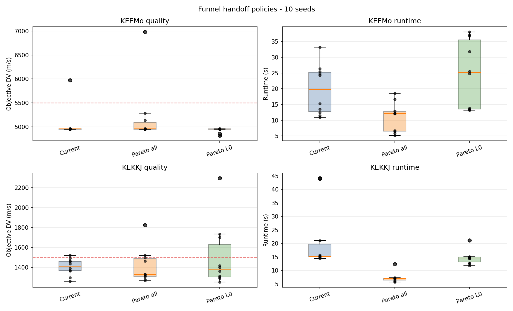

| Case | Policy | Success proxy | Median DV | Best DV | Worst DV | Median runtime |
|---|---|---:|---:|---:|---:|---:|
| KEEMo | current | 9/10 below 5500 | 4958.0 | 4950.2 | 5975.9 | 19.8 s |
| KEEMo | Pareto all | 9/10 below 5500 | 4959.8 | 4948.5 | 6981.6 | 12.1 s |
| KEEMo | Pareto L0 | **10/10 below 5500** | **4952.9** | **4816.4** | **4960.5** | 25.1 s |
| KEKKJ | current | **9/10 below 1500** | 1411.9 | 1260.3 | 1519.6 | 15.2 s |
| KEKKJ | Pareto all | 8/10 below 1500 | **1328.7** | 1265.9 | 1825.3 | 7.1 s |
| KEKKJ | Pareto L0 | 7/10 below 1500 | 1380.4 | **1252.9** | 2296.0 | 14.6 s |

Interpretation:

- Pareto handoff is useful, but its effect is strongly sequence-dependent.
- Applying it at every stage improves the typical KEKKJ result but worsens the failure tail and does not stabilize KEEMo.
- Restricting it to L0 completely stabilizes KEEMo in this sample and recovers the previously missed seed, but makes three KEKKJ seeds substantially worse.
- On problematic KEKKJ seeds, the L1 champion can improve while MBH and the exact archive later converge to a worse basin. Handoff quality therefore cannot be judged only from the next-stage champion.

Decision: retain both policies as explicit experimental strategy suffixes, but do not promote either as the global funnel default. The next test should make early Pareto selection more quality-biased or use basin quotas/cluster representatives so diversity cannot consume too much of the KEKKJ handoff population.

## Basin quality/density allocation experiment

Experiment date: 2026-07-16
Strategy: `funnel_l0_recall_64_mbh_between_basin_l0_pressure_cascade`
Cases: Vanilla KEKKJ, JNSQ KEEMo
Seeds: 0-9

This cheaper precursor to successive halving clusters the quality-gated L0 champions in the established encounter-phase embedding. Up to eight basins receive one guaranteed L1 seed; remaining seed slots are allocated using rank-based quality mass and basin density. The L1 budget and every later handoff remain unchanged.

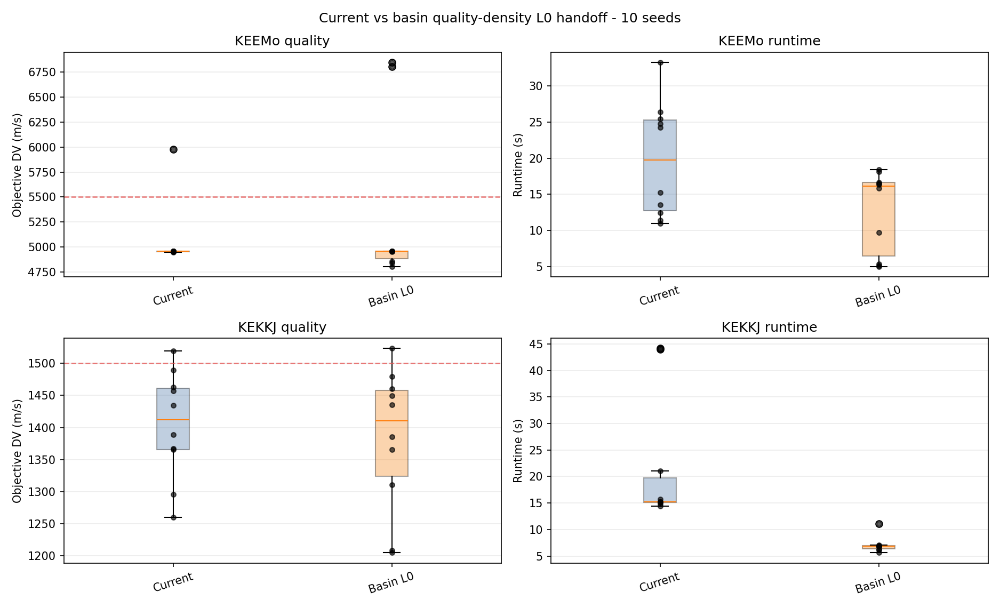

| Case | Policy | Success proxy | Median DV | Best DV | Worst DV | Median runtime |
|---|---|---:|---:|---:|---:|---:|
| KEEMo | current | **9/10 below 5500** | 4958.0 | 4950.2 | **5975.9** | 19.8 s |
| KEEMo | Basin L0 | 8/10 below 5500 | **4956.1** | **4802.4** | 6846.4 | 16.1 s |
| KEKKJ | current | 9/10 below 1500 | 1411.9 | 1260.3 | **1519.6** | 15.2 s |
| KEKKJ | Basin L0 | 9/10 below 1500 | **1410.5** | **1205.0** | 1523.1 | 6.9 s |

Interpretation:

- Basin allocation improves six of ten paired KEKKJ seeds and produces better best solutions without damaging KEKKJ recall.
- It does not generalize to KEEMo: the historically bad seed is recovered, but two previously good seeds move into poor basins.
- Combined recall is 17/20 instead of 18/20 for the current policy.
- Runtime measurements remain affected by rescue count and machine conditions and are not treated as a proven speedup.

Decision: keep `basin_l0` experimental and do not implement the more complex L1 mini-probe/successive-halving stage yet. The density signal is real for KEKKJ but not sufficiently predictive across sequences to justify additional funnel layers. The existing pressure-cascade handoff remains the production candidate.

## Hill-Valley L0 handoff experiment

Experiment date: 2026-07-16
Cases: Vanilla KEKKJ, JNSQ KEEMo
Seeds: 0-9

The experimental handoff follows the Hill-Valley niching idea:

1. use the complete final L0 population;
2. quality-gate it to the best 35 percent;
3. build a nearest-better graph in normalized decision space;
4. evaluate up to three interpolated points on candidate edges;
5. keep at least one champion per detected valley before filling remaining L1 slots by fitness.

Flyby beta variables use circular distance and shortest-arc interpolation. Evolution after the handoff remains entirely PyGMO-based.

Two policies were benchmarked:

- `hill_valley_l0`: strict separation when any intermediate point is worse than both endpoints;
- `hill_valley_p2_l0`: persistence-aware separation requiring the intermediate barrier to exceed the endpoint cost by 200 percent.

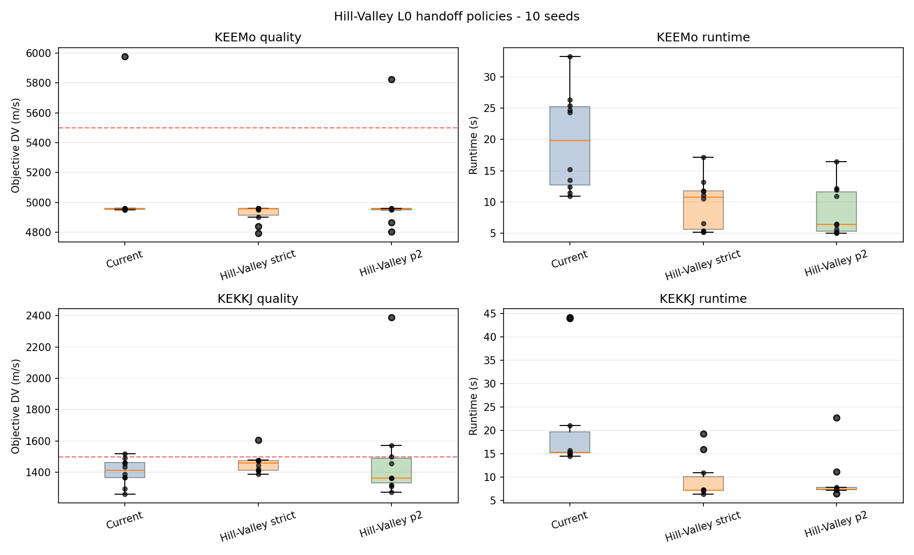

| Case | Policy | Success proxy | Median DV | Best DV | Worst DV | Median runtime |
|---|---|---:|---:|---:|---:|---:|
| KEEMo | current | 9/10 below 5500 | 4958.0 | 4950.2 | 5975.9 | 19.8 s |
| KEEMo | Hill-Valley strict | **10/10 below 5500** | 4955.9 | **4794.3** | **4959.9** | 10.8 s |
| KEEMo | Hill-Valley p2 | 9/10 below 5500 | **4953.2** | 4803.7 | 5821.9 | 6.4 s |
| KEKKJ | current | **9/10 below 1500** | **1411.9** | **1260.3** | **1519.6** | 15.2 s |
| KEKKJ | Hill-Valley strict | **9/10 below 1500** | 1458.5 | 1386.4 | 1605.1 | 7.2 s |
| KEKKJ | Hill-Valley p2 | 7/10 below 1500 | 1363.0 | 1272.0 | 2386.9 | 7.4 s |

Diagnostics from the stored L0 populations:

- strict KEEMo: 101-116 detected valleys out of 180 candidates;
- strict KEKKJ: 111-136 valleys;
- p2 KEEMo: 18-27 valleys, median 23;
- p2 KEKKJ: 7-15 valleys, median 9.5.

Interpretation:

- Strict Hill-Valley gives the best combined recall observed so far: 19/20, versus 18/20 for current.
- It stabilizes KEEMo completely, but over-fragments the landscape and gives too little family depth to KEKKJ, degrading its typical quality.
- The persistence threshold fixes over-fragmentation but merges narrow useful valleys and produces severe KEKKJ failures.
- The extra Hill-Valley evaluations are small relative to L0 and no standalone runtime penalty is visible; runtime remains dominated by pressure-cascade branches and machine conditions.

Decision: Hill-Valley is a promising experimental direction but is not ready to replace the current handoff. Keep the strict version for a larger-seed confirmation. Do not promote the fixed p2 threshold. A future refinement should reserve most L1 slots for strict valley champions while retaining a small number of family-depth slots, rather than merging valleys based on one global barrier threshold.

### Multi-resolution slot-count follow-up

Two additional strict Hill-Valley variants tested whether the KEKKJ degradation came from having only 16 L1 seed slots:

- `hill_valley_mr_l0`: 16 wide islands, split into 12 strict-valley roots and 4 family-depth candidates;
- `hill_valley_mr32_l0`: 32 wide islands, split into 24 roots and 8 family-depth candidates.

The 32-island variant keeps the nominal wide-stage budget exactly constant by changing the island population from 32 to 16:

`16 * 32 * 5 * 20 = 32 * 16 * 5 * 20 = 51,200 evaluations`.

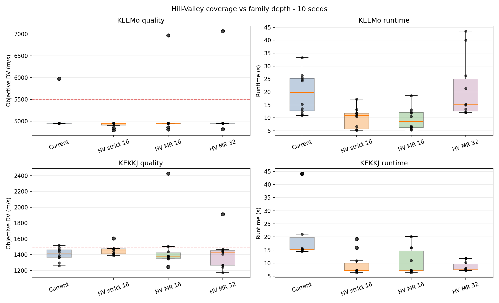

| Case | Policy | Success proxy | Median DV | Best DV | Worst DV | Median runtime |
|---|---|---:|---:|---:|---:|---:|
| KEEMo | current | 9/10 | 4958.0 | 4950.2 | 5975.9 | 19.8 s |
| KEEMo | strict 16 roots | **10/10** | 4955.9 | **4794.3** | **4959.9** | 10.8 s |
| KEEMo | MR 16 (12+4) | 9/10 | **4954.0** | 4815.1 | 6972.8 | 8.6 s |
| KEEMo | MR 32 (24+8) | 9/10 | 4959.8 | 4818.6 | 7069.3 | 15.1 s |
| KEKKJ | current | **9/10** | **1411.9** | 1260.3 | **1519.6** | 15.2 s |
| KEKKJ | strict 16 roots | **9/10** | 1458.5 | 1386.4 | 1605.1 | 7.2 s |
| KEKKJ | MR 16 (12+4) | 8/10 | 1380.1 | 1246.1 | 2427.0 | 7.3 s |
| KEKKJ | MR 32 (24+8) | **9/10** | 1423.0 | **1171.1** | 1911.0 | 7.7 s |

Interpretation:

- Sixteen slots are not simply insufficient: strict 16 still has the best combined recall, 19/20.
- Family-depth slots improve typical KEKKJ quality but sacrifice rare valleys, causing severe tails.
- Doubling island count at constant budget discovers excellent KEKKJ minima, but halving each SADE population weakens local robustness and does not improve recall.
- The existing 16-by-32 wide stage is therefore a reasonable balance between inter-island coverage and within-island population depth.

Decision: do not promote either multi-resolution variant and do not enlarge L1 to 32 under a fixed budget. Keep strict Hill-Valley as the only promising experimental handoff; keep the current handoff as the production default until strict Hill-Valley is confirmed on a larger seed set.

### Identical-L0, equal-budget validation

The earlier integrated runs did not prove that the handoff alone caused the
difference: asynchronous L0 runs can produce different final populations even
with paired optimizer seeds. A stricter benchmark therefore loaded one stored
L0 population per seed, selected both handoffs from those exact 512 individuals,
and ran the same fixed-budget L1/MBH/L2/L3 plan. Adaptive L3 stopping was disabled
so both branches received 5/1/10/10 evolution steps.

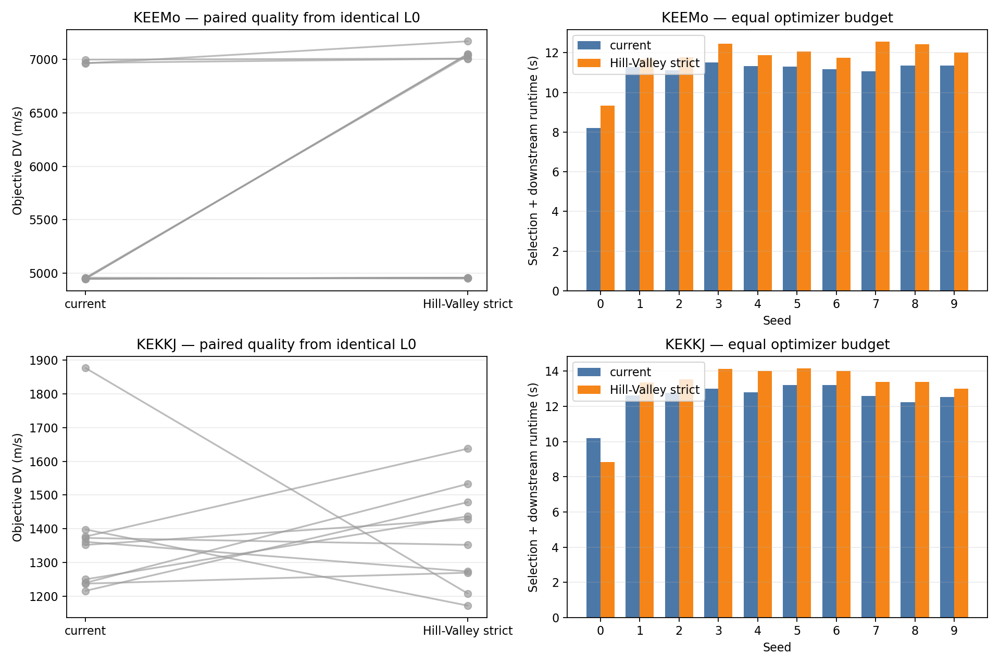

| Case | Handoff | Success proxy | Median DV | Handoff wins | Median selection + downstream runtime |
|---|---|---:|---:|---:|---:|
| KEEMo | current | 7/10 below 5500 | **4955.7** | **9/10** | **11.29 s** |
| KEEMo | Hill-Valley strict | 4/10 below 5500 | 7004.5 | 1/10 | 11.95 s |
| KEKKJ | current | **9/10 below 1500** | **1356.6** | 6/10 | **12.70 s** |
| KEKKJ | Hill-Valley strict | 8/10 below 1500 | 1390.3 | 4/10 | 13.48 s |

For KEKKJ, retaining the best of both handoffs gives 10/10 below 1500 and a
1244.8 m/s median. For KEEMo, the failures overlap: seeds 1, 2 and 8 fail in
both normal-budget branches. This rejects strict Hill-Valley as a universal
replacement but preserves it as a potentially useful conditional KEKKJ rescue.

The Hill-Valley selection itself costs a median 0.71 s for KEEMo and 1.13 s for
KEKKJ, versus roughly 0.02 s for the current champion/diversity selection.

A targeted 2x downstream-budget rerun of the three shared KEEMo failures
recovered seed 8 with the current handoff and seed 2 with Hill-Valley. Seed 1
remained near 7 km/s in both branches. The targeted median runtime increased by
about 50--90 percent. The nominal budget is therefore too short for some
handoffs, but blind global doubling is not a consistency solution: some L0
populations still lack an exploitable path, and the useful rescue policy differs
by seed.

Decision: keep the current handoff as default. Do not globally double the
downstream budget. The next experiment should be a threshold-free conditional
rescue that uses internal progress/archive disagreement to decide whether to
continue the current handoff or try Hill-Valley.

### Adaptive Hill-Valley decision pilot

A retrospective leave-one-out policy was tested without sequence-specific DV
thresholds. At the end of L2 it observes two dimensionless quantities:

- relative improvement from MBH to L2;
- relative gap between the best and median exactly rescored archive members.

The trigger region is calibrated from the other runs only: L2 progress below
its 75th percentile and archive gap between its 30th and 70th percentiles. A
triggered Hill-Valley branch is retained only if its final exact result beats
the current branch. These quantiles are pilot calibration values, not yet a
production policy.

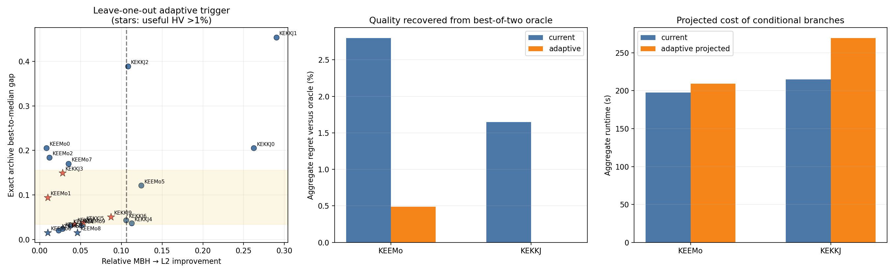

| Case | Triggers | Useful HV captured | Current median | Adaptive median | Worst adaptive | Projected overhead |
|---|---:|---:|---:|---:|---:|---:|
| KEEMo | 1/10 | 1/3 | 4958.0 | 4955.8 | **4960.1** | +5.9% |
| KEKKJ | 4/10 | **4/4** | 1411.9 | **1387.7** | **1473.4** | +25.4% |
| Combined | 5/20 | 5/7 | - | - | - | **+16.1%** |

The missed KEEMo improvements are small (1.2 and 3.3 percent); the policy does
capture the 19-percent failure and removes the 5975.9 m/s tail. Aggregate regret
to the best-of-two oracle falls from 2.80 to 0.49 percent for KEEMo and from
1.65 percent to zero for KEKKJ.

An independent replay using the identical-L0 equal-budget results is less
favorable but still safe because the exact best is retained. It captures 3/4
Hill-Valley wins for KEKKJ and reaches the oracle median, but does not capture
the sole KEEMo Hill-Valley win. This confirms that downstream stochasticity can
change which handoff wins and that the 20-run pilot is too small to promote the
quantile rule directly into production.

Decision: the adaptive concept is promising and meets the target runtime on the
historical integrated runs, but remains an experimental harness. The next
validation should freeze the learned quantiles, run fresh seeds, and compare it
against both the current funnel and the unconditional best-of-two oracle.

### Frozen-policy validation on fresh seeds 10--19

The quantile cuts learned on seeds 0--9 were frozen before running 40 new full
funnels: current and strict Hill-Valley for KEEMo and KEKKJ, seeds 10--19. No
threshold was recalibrated from the new results.

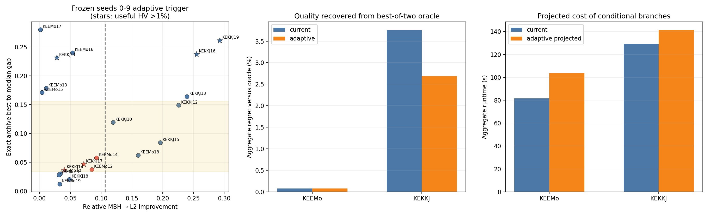

| Case | Triggers | Useful HV captured | Current median | Adaptive median | Oracle median | Projected overhead |
|---|---:|---:|---:|---:|---:|---:|
| KEEMo | 2/10 | 0/0 | 4956.7 | 4956.7 | 4949.5 | +27.1% |
| KEKKJ | 2/10 | 2/5 | 1403.5 | **1367.8** | 1313.2 | +9.4% |
| Combined | 4/20 | 2/5 | - | - | - | +16.3% |

The adaptive policy lowers the KEKKJ median and worst result, but misses useful
Hill-Valley branches on seeds 11, 16 and 19. Its aggregate KEKKJ regret to the
best-of-two oracle remains 2.69 percent. The two KEEMo triggers add cost without
material quality gain. KEEMo seed 19 remains poor in both branches (5528 versus
6393 m/s), so changing the handoff cannot rescue that L0 outcome.

Decision: validation failed the promotion criterion. Do not integrate this
fixed quantile policy into the production funnel. Current-branch progress and
archive spread are not sufficient predictors of an independently useful
Hill-Valley basin. Keep the harness and telemetry; the next design should test a
small explicit two-arm probe or a fixed-budget current/Hill-Valley portfolio,
rather than retuning thresholds on these new seeds.

### Fixed-budget 75/25 handoff portfolio

The final Hill-Valley experiment removes prediction entirely. From every stored
L0 population it initializes the 16 L1 islands with 12 current
champion/diversity seeds and 4 distinct strict Hill-Valley roots. Both policies
share the same downstream algorithms and evaluation budget; Hill-Valley
selection adds only 0.27--0.44 seconds median overhead.

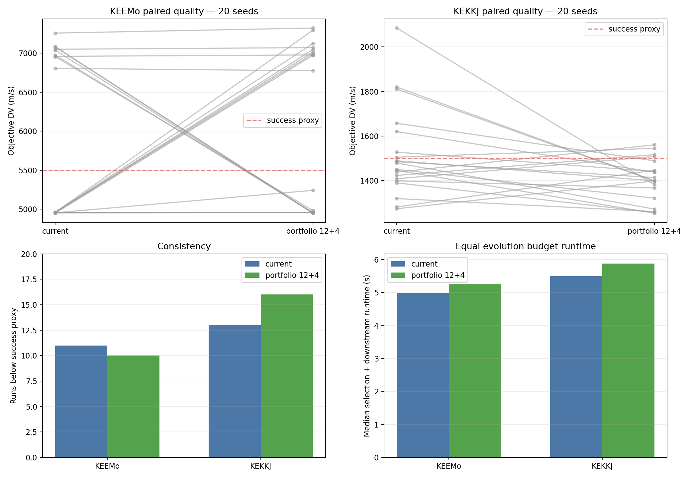

| Case | Handoff | Successes | Median DV | Best DV | Worst DV | Median runtime |
|---|---|---:|---:|---:|---:|---:|
| KEEMo | current | **11/20** | **4960.4** | **4948.7** | **7257.1** | **4.99 s** |
| KEEMo | portfolio 12+4 | 10/20 | 6007.6 | 4948.7 | 7322.0 | 5.27 s |
| KEKKJ | current | 13/20 | 1464.2 | 1273.0 | 2085.0 | **5.50 s** |
| KEKKJ | portfolio 12+4 | **16/20** | **1398.5** | **1253.1** | **1560.0** | 5.88 s |

The portfolio wins 14/20 paired KEKKJ runs, lowers the median by 65.7 m/s and
removes the worst 2-km/s tail. For KEEMo it wins only 6/20 and merely swaps good
and bad basins: five poor current runs are rescued, but several previously good
runs are lost, leaving consistency slightly worse.

Decision: the fixed portfolio has real value for the KEKKJ-like landscape but
is not a coherent universal default. Do not integrate it into the production
funnel. Preserve the benchmark implementation as an experimental handoff; stop
general Hill-Valley tuning here and move to the next optimizer work item. If a
future sequence-specific profile is justified, the 12+4 portfolio is the only
Hill-Valley variant worth revisiting.

### Additive 16+4 split-ring portfolio

The 12+4 result could not distinguish harmful Hill-Valley migration from the
loss of four current seeds. A final additive experiment therefore retains all
16 current L1 islands and adds 4 strict Hill-Valley islands. The two groups form
independent bidirectional rings joined by one bidirectional bridge of weight
0.25. After L1, all 20 populations enter the normal global MBH selection and
the remainder of the funnel returns to its standard island counts.

The topology contains 20 vertices and 42 directed edges. Initial seeds are
explicitly kept in current-then-Hill-Valley order so the four alternative seeds
cannot be silently reassigned to the large ring.

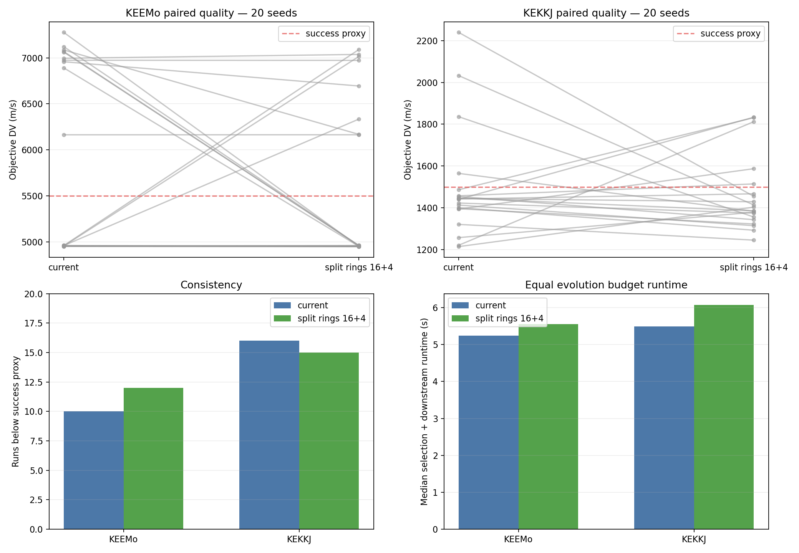

| Case | Handoff | Successes | Median DV | Best DV | Worst DV | Median runtime |
|---|---|---:|---:|---:|---:|---:|
| KEEMo | current 16 | 10/20 | 5561.8 | 4951.2 | 7276.2 | **5.24 s** |
| KEEMo | split rings 16+4 | **12/20** | **4959.8** | **4948.7** | **7090.4** | 5.55 s |
| KEKKJ | current 16 | **16/20** | 1441.1 | **1213.8** | 2239.7 | **5.49 s** |
| KEKKJ | split rings 16+4 | 15/20 | **1393.8** | 1244.9 | **1833.5** | 6.08 s |

The additive portfolio wins 13/20 paired KEEMo runs and 12/20 KEKKJ runs. It
restores KEEMo consistency instead of exchanging current and Hill-Valley
basins, while retaining the KEKKJ median and tail improvement. Median measured
runtime rises by 5.9 percent for KEEMo and 10.7 percent for KEKKJ.

Interpretation: removing four current seeds was the main design error in the
12+4 portfolio. The additive split-ring design is the first Hill-Valley variant
to improve both benchmark landscapes at acceptable cost. The experiment does
not isolate topology from added capacity; a 20-island shared-ring control would
be required to attribute the gain specifically to reduced migration.

Decision: preserve 16+4 split-ring as a serious experimental funnel candidate,
but do not replace the production default. It is exposed explicitly as
`funnel_l0_recall_64_mbh_between_portfolio_16_4_l0_pressure_cascade`. Its full
stage configuration, topology dimensions and migration telemetry are persisted,
so the experiment can be replayed without changing normal funnel behavior.
Further Hill-Valley threshold tuning is not justified.

## Internal API decision

`initial_seed_genes` is kept for now as an internal experimental API.

That means:

- it is callable from Python benchmark harnesses;
- it is not yet a stable user-facing option;
- it is not persisted in SQLite;
- a run using it cannot be fully reconstructed from the DB alone unless the seed source and generation policy are documented externally.

Before exposing it to a GUI or treating it as production, we should persist enough metadata to replay it:

- source DB and run IDs;
- source sequence;
- extension policy;
- generated seed hash;
- number of seed genes injected.

## Validation

Fast validation performed:

- `py_compile` on modified scripts/core files;
- full test suite after the upstream scout tranche: `102 passed, 36 subtests passed`;
- optimizer smoke run with `funnel_l0_recall_64_mbh_between_pressure_cascade`;
- optimizer smoke run with the experimental 16+4 split-ring pressure cascade;
- integrated 10-seed rerun on KEEMo/KEKKJ;
- summary-only rerun of the prior-seed benchmark analysis.

## Recommended next steps

1. Keep the production pressure cascade and the 16+4 split-ring option stable.
2. Benchmark the new Tisserand plus Lambert arc-1 layer for recall, pruning
   ratio, grid resolution and runtime on known KEKKJ/KEEMo windows.
3. Convert surviving Lambert samples into conservative T0/first-leg TOF boxes,
   then integrate explicit sequence-to-job generation in SQLite.
4. Add persistence if/when `initial_seed_genes` becomes more than an experiment.
5. For GUI preparation, expose funnel configuration and benchmark summaries,
   not raw experimental hooks.
6. Keep KEEMoMo prior-seeded continuation as a future “trajectory extension”
   research path.
