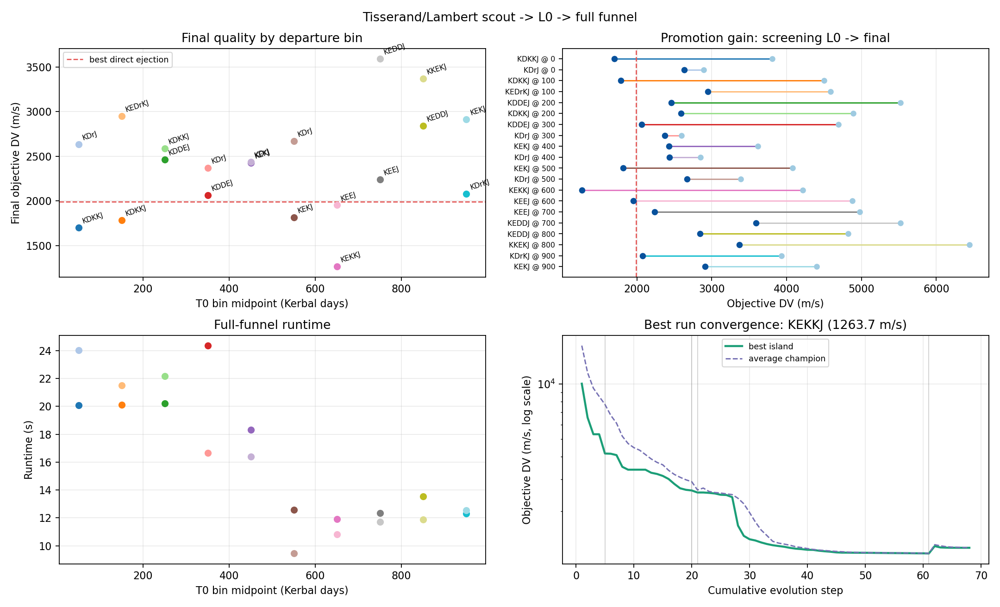

# Sequence scout + L0 benchmark

## Objective

Validate the proposed sequence-search workflow on Vanilla Kerbin to Jool:

1. generate plausible sequences with the unphased Tisserand scout;
2. reject energetically poor first arcs with the Lambert filter;
3. scan departure dates from day 0 to 1000 in 100-day bins;
4. run the real Wayfinder L0 on every surviving job belonging to the 20
   highest-ranked unique sequences;
5. promote the two best L0 basins per departure bin to the full funnel.

The direct Kerbin-to-Jool reference is computed globally over the complete
departure interval, rather than separately in each bin. Its parking-orbit
ejection cost is 1988.9 m/s.

## Configuration

- 58 raw Tisserand sequences;
- 308 viable sequence/bin candidates;
- 54 unique viable sequences;
- 20 highest-ranked unique sequences retained;
- 119 real L0 jobs;
- L0: 64 disconnected PyGMO SADE islands, population 8, 5 evolution steps,
  20 generations per step;
- promotion: two lowest L0 objectives per 100-day bin;
- 20 complete funnels using `scout_archive_nm_64_mbh_between`.

## Results

| Metric | Result |
|---|---:|
| L0 wall time | 351.4 s |
| Full-funnel wall time | 323.0 s |
| Total optimization time | 674.5 s |
| Median full-funnel runtime | 15.0 s |
| Median final objective | 2431.5 m/s |
| Results below direct ejection reference | 5 / 20 |
| Best result | KEKKJ, 1263.7 m/s |
| Best departure bin | day 600–700 |

The benchmark supports the architecture: cheap broad L0 screening can select a
small portfolio of basins for expensive optimization while recovering the
known valuable KEKKJ family. It does not yet prove that two promotions per bin
are always sufficient. A basin with mediocre approximate L0 fitness can still
become excellent under the exact downstream model, so the promotion width must
remain configurable and should be revisited across several targets.



## Reproduction

Run, in order:

```powershell
python Tests/run_sequence_scout_l0_benchmark.py
python Tests/run_sequence_scout_full_funnel_benchmark.py
python Tests/analyze_sequence_scout_funnel.py
```

The benchmark JSON and temporary plot under `Tests/` are generated artifacts
and are intentionally ignored by Git. The figure above is the retained release
evidence.
